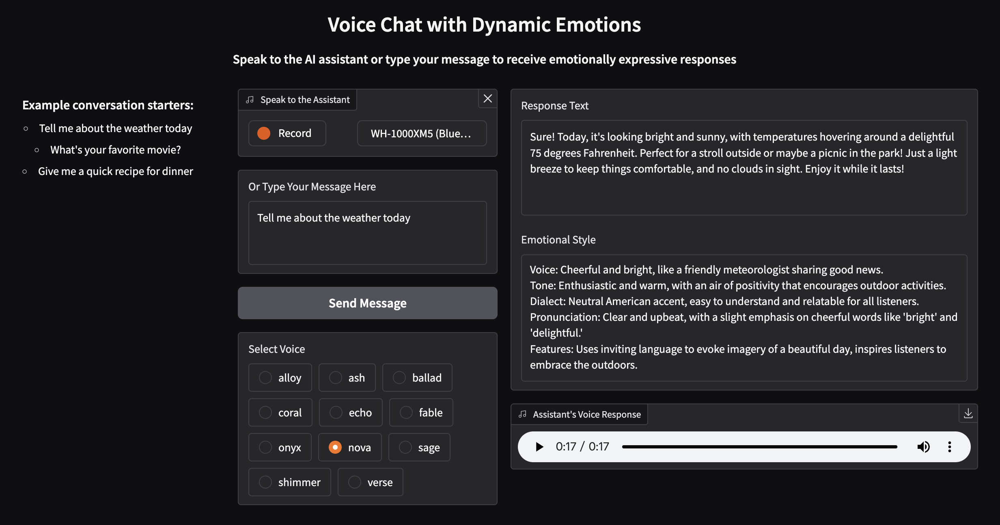

# Speech-to-speech demo
A speech-to-speech demo using latest text-to-speech model in the OpenAI API, with streaming and emotion generated together with response.



Dependencies:
```
pip install -r requirements.txt
```

Usage:
```
python ui.py
```